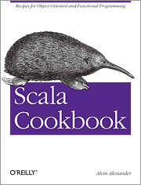

[//]: <> (trans-es -> description:Examinando dos poderosas bondades del lenguaje Scala como son pattern matching y de el extractor object.)

I want to show you two powerful syntax that the scala language has.

[//]: <> (trans-es -> Quiero mostrarle dos poderosas sintaxis que posee el lenguaje escala.)
 
We will start with the Pattern matching, this syntax in used when we want to match one or more patterns in an expression such as a constant pattern, variable pattern, constructor pattern, sequence pattern, tuple pattern or type pattern.

[//]: <> (trans-es -> Comenzaremos con el Pattern matching, esta sintaxis en usada cuando queremos hacer coincidir uno o más patrones en una expresión como pueden ser un patrón constante, patrón variable, patrón constructor, patrón de secuencia, patrón de tupla o patrón de tipo.)

## Pattern matching
>Pattern matching is a mechanism for checking a value against a pattern. A successful match can also deconstruct a value into its constituent parts. It is a more powerful version of the switch statement in Java and it can likewise be used in place of a series of if/else statements.

The following examples show many different types of patterns that can be used:

[//]: <> (trans-es -> El siguiente ejemplos muestra muchos tipos diferentes de patrones que se pueden usar:)

```scala
  val ZERO = "zero"
  val ONE  = "one"
  val TWO  = "two"
  val MANY = "many"

  val number: Int = Random.nextInt(6)

  def numberAsLiteralString(value: Int): String = value match {
    case 0 => ZERO
    case 1 => ONE
    case 2 => TWO
    case _ => MANY
  }

  val numberAsString = numberAsLiteralString(number)
  //numberAsString = "one"
```

## Extractor objects
> An extractor object is an object with an `unapply` method. Whereas the `apply` method is like a constructor which takes arguments and creates an object, the `unapply` takes an object and tries to give back the arguments. This is most often used in pattern matching and partial functions.

......

## Constant patterns

Any literal can be used as a constant. A constant pattern can only coincide with itself, this means that if we declare a variable with value 2 it will only coincide with an Int value of 2. e.g:

[//]: <> (trans-es -> Cualquier literal puede ser usado como una constante. Un patrón constante solo puede coincidir con si mismo, esto significa que si declaramos una variable con valor 2 solo coincidirá con un valor Int de 2. e.g:)

```scala
val value: Int = 2
  val result: String = value match {
    case 2 => "two"
    case 3 => "three"
  }
// res0: result: String = "two"
```

## Variable patterns

A variable pattern matches any object just like the wildcard character. For example, at the end of a match expression, you can use the wildcard character to match any type or capture the value in a variable. e.g:

[//]: <> (trans-es -> Un patrón variable coincide con cualquier objeto al igual que el carácter comodín. Por ejemplo, al final de una expresión de coincidencia, puede usar el carácter comodín para coincidir con cualquier tipo o capturar el valor en una variable. e.g:)

```scala
val value: Int = 2
val result: String = value match {
  case _ => "any"
}
// res0: result: String = "any"
```
Or you can write this instead:

```scala
val value: Int = 2
val result: String = value match {
  case foo => s"My value is $foo"
}
// res0: result: String = "My value is 2"
```

## Constructor patterns

The constructor pattern lets you match a constructor in a case statement. As shown in the examples, you can specify constants or variable patterns as needed in the constructor pattern:

[//]: <> (trans-es -> El patrón del constructor le permite hacer coincidir un constructor en una declaración de caso. Como se muestra en los ejemplos, puede especificar constantes o patrones variables según sea necesario en el patrón del constructor:)

```scala
trait Person {
  val name: String
  val age: Int
}

case class Student(name: String, age: Int, averageScore: Double) extends Person

case class Teacher(name: String, age: Int, totalOfClasses: Int) extends Person

val person: Person = Student("Martin", 17, 4.75)
val result: String = person match {
    case Student(name, _, averageScore) => s"The student $name has a average score $averageScore"
    case Teacher("John", age, _)        => s"The teacher John has $age years old"
  }
// res0: result: String = "The student Martin has a average score 4.75"
```

## Type patterns

A match for a specific type

[//]: <> (trans-es -> Una coincidencia para un tipo específico)

```scala
val valueAny: Any = "2"
val result5: String = valueAny match {
  case v: Int    => s"The value $v is a Int"
  case v: String => s"The value $v is a String"
}
// res0: result: String = "The value 2 is a String"
```

## Sequence patterns
You can match against sequences like List, Array, Vector or others. Use the _ character to stand for one element in the sequence and use _* to stand for “zero or more elements” e.g:

[//]: <> (trans-es -> Puede hacer coincidir contra secuencias como Lista, Array, Vector u otros. Use el carácter _ para representar un elemento de la secuencia y use _ * para representar “cero o más elementos”, como se muestra en los ejemplos:)


```scala
  val sequence: Iterable[Int] = List(1, 2, 3, 4)
  val result: String = sequence match {
  case List(0, _, _)      => "A three element list with 0 as the first element"
  case list @ List(1, _*) => s"A list beginning with 1, having any number of elements: [$list]"
  case Vector(1, _*)      => "A vector beginning with 1 and having any number"
}
  // res0: result: String = "A list beginning with 1, having any number of elements [List(1, 2, 3, 4)]"
```

## Tuple patterns

We can match tuple patterns and access the value of each element in the tuple. You can also use the _ wildcard if you’re not interested in the value of an element e.g:

[//]: <> (trans-es -> Podemos hacer coincidir los patrones de tuplas y acceder al valor de cada elemento en la tupla. También puedes usar el comodín _ si no estás interesado en el valor de un elemento:)

```scala
val tuple: Any = (1, 2)
val result7: String = tuple match {
  case (a, b)       => s"A two elem tuple, with values $a, and $b"
  case (a, b, c)    => s"A three elem tuple, with values $a, $b, and $c"
  case (a, b, c, _) => s"A four elem tuple: got $a, $b, $c and more element"
}
// res0: result: String = "A two elem tuple, with values 1, and 2"
```

## Adding variables to patterns
At times you may want to add a variable to a pattern. You can do this with the following general syntax:


[//]: <> (trans-es -> A veces es posible que desee agregar una variable a un patrón. Puedes hacer esto con la siguiente sintaxis general:)

```scala
value match {
  case variableName @ pattern
}
```
You know that you can do this

```scala
value match {
  case list: List[_] => s"The List: $list"
}
```
so it seems like you should try this with a sequence pattern:

```scala
value match {
  case list: List(1, _*) => s"The List: $list"
}
```
Unfortunately, this fails with the following compiler error:

```scala
Error:(72, 21) '=>' expected but '(' found.
    case list : List(1, _*) => s"The List: $list"
```
The solution to this problem is to add a `variable-binding pattern` to the sequence pattern:

```scala
value match {
  case list @ List(1, _*) => s"The List: $list"
}
```
or

```scala
value match {
  case s @ Student(name, _, averageScore) => s"The student $name has a average score $averageScore: student = [$s]"
}
```

I hope it has been very helpful for you, if you have arrived here, it means that you have been able to understand these two powerful Scala syntax and the associated concepts. You can find the examples of this post [here](https://github.com/llfrometa89/blog_scala_examples/blob/master/src/main/scala/com/llfrometa/patern_matching/PlayingWithPatternMatching.scala).

[//]: <> (Espero que haya sido de gran ayuda para usted. Si ha llegado aquí, significa que ha podido entender estas dos poderosas sintaxis de Scala y los conceptos asociados. Puedes encontrar los ejemplos aquí.)


## See Also
- <a href="https://docs.scala-lang.org/tour/pattern-matching.html" target="_blank">https://docs.scala-lang.org/tour/pattern-matching.html</a>
- <a href="https://docs.scala-lang.org/tour/extractor-objects.html" target="_blank">https://docs.scala-lang.org/tour/extractor-objects.html</a>
- <a href="https://alvinalexander.com/scala/how-to-use-pattern-matching-scala-match-case-expressions" target="_blank">https://alvinalexander.com/scala/how-to-use-pattern-matching-scala-match-case-expressions</a>

## The Scala Cookbook

<br>


You can find the Scala Cookbook at these locations:

- [Here on the O’Reilly website, and](http://shop.oreilly.com/product/0636920026914.do)
- [Here on Amazon.com](https://www.amazon.com/dp/1449339611/ref=cm_sw_su_dp)
